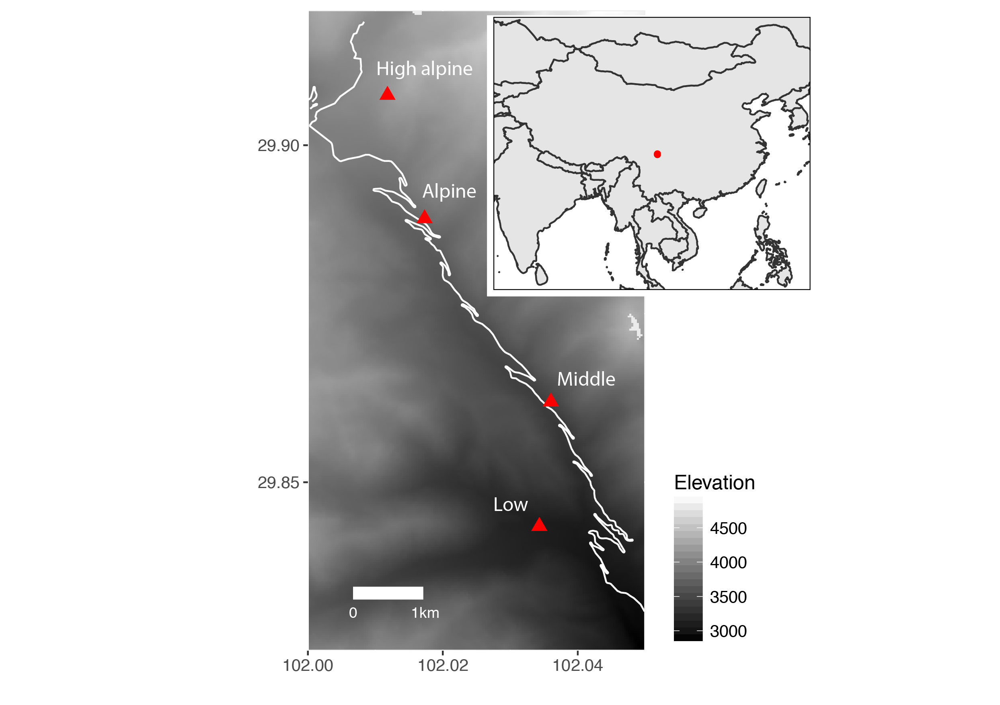
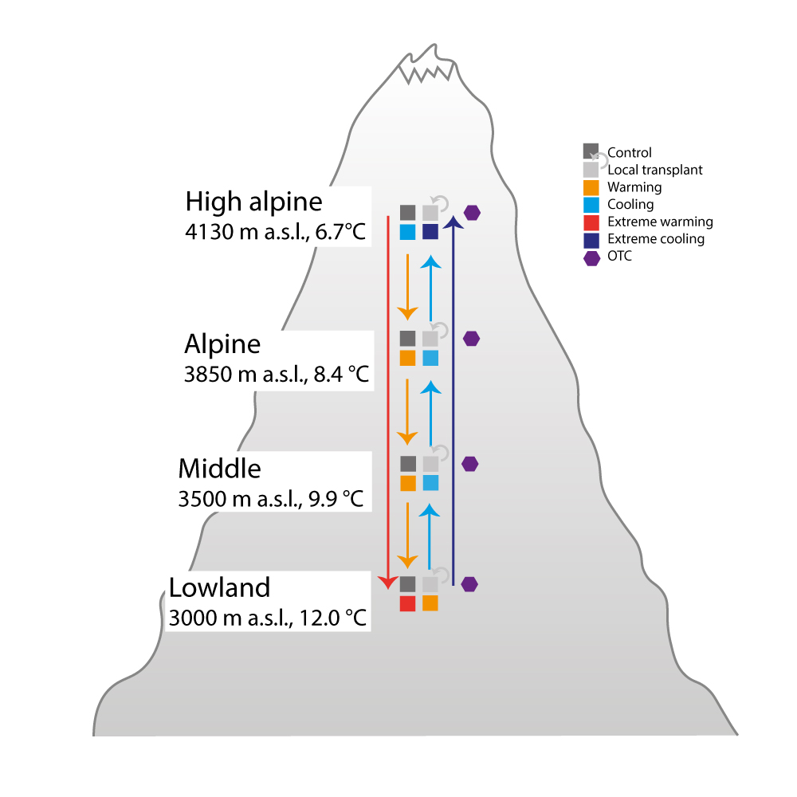

<style>
p.caption {
  font-size: 0.8em;
}
</style>

```{r, include = FALSE}
knitr::opts_chunk$set(
  collapse = TRUE,
  comment = "#>",
  message = FALSE,
  warning = FALSE
)
library("tidyverse")
library("readxl")
library("dataDownloader")
library("cowplot")
library("vegan")
library("ggvegan")
#library("googlesheets")

source("community/start_here.R")

knitr::read_chunk("DataPaper_Vandviketal_2020/1_Download_Data.R")
knitr::read_chunk("DataPaper_Vandviketal_2020/2_Figures_ChinaDataPaper.R")
knitr::read_chunk("climate/R/Clean_iButtonData/3_DownloadCleanData_CalcMeans_Plot.R")

theme_set(theme_bw(base_size = 12))


```
# TRANSPLANT EXPERIMENT GONGGA MOUNTAIN - CHINA

## STUDY AND SITE INFORMATION
The transplant study is located in the Gongga Mountains in Sichuan Province, south-west China. The study contains four sites spanning from 3000 to 4130 m a.s.l. along an elevational gradient. The vegetation ranges from coniferous-broadleaved forest to alpine meadows.

```{r echo=FALSE, eval = FALSE}
get_file(node = "f3knq",
         file = "metaCH.csv",
         path = "data")
```

```{r echo=FALSE}
read.csv(file = "data/metaCH.csv", header = TRUE, sep = ";") %>% 
  select(-Country, -Gradient) %>% 
  mutate(Site = recode(Site, "H" = "High Elevation", "A" = "Alpine", "M" = "Middle", "L" = "Lowland")) %>% 
  knitr::kable()

```

```{r echo=FALSE, out.width='60%', fig.cap= "Location of the four study sites along an elevational gradient. Inset indicates the locations of the study sites in China."}

```

```{r echo=FALSE, out.width='60%', fig.cap= "Experimental set up fo rht different warming treatments at each site. Shown are control, local control, OTC, and transplant and arrows indicate direction of transplant"}

```

## The experimental set-up
Each of four study sites contains an in situ warming experiments using OTCs and reciprocal community transplantation experiments (i.e., warming and cooling) between all pairs of neighbouring sites along the gradient.
Within each of the seven blocks at each site, plots were randomly designated to six different experimental treatments:

- passive warming with an open top chamber (OTC; all sites)
- transplanting to a site one step warmer along the gradient (warming; from sites High alpine, Alpine, Middle alpine
- transplanting to a site one step colder along the gradient (cooling; from sites Alpine, Middle alpine, Lowland
- transplanting down the entire gradient (extreme warming; from site High alpine)
- up the entire gradient (extreme cooling, from site Lowland)
- transplanting within blocks (to control for the transplanting itself)(Local transplant; all sites)
- an untouched control plot (Control; all sites)

Thus, each OTC has a local unmanipulated control, and each transplanted turf has an “origin” site and a “destination” site, with two types of controls, local transplant and untouched plots, in each


## DATASETS, CODE AND ANALYSES
The raw and cleaned datasets are stored on OSF Transplant Experiment Gongga Mountain: https://osf.io/f3knq/

The data was processed and analysed using R. All code is stored on github: https://github.com/richardjtelford/transplant

### Download data
To download the data, the following function can be used:

```{r eval=FALSE}
#install.packages("remotes")
remotes::install_github("Between-the-Fjords/dataDownloader")
library("dataDownloader")
```


```{r eval=FALSE}
#Download files from OSF
get_file(node = "f3knq",
         file = "biomass2015.xls",
         path = "biomass/data",
         remote_path = "RawData")
```

Use the following nodes, files and remote path to download the data:

```{r echo=FALSE}
# dat <- gs_title("LocationOfPFTCData")
# traits <- gs_read(ss = dat, ws = "Tabellenblatt1") %>%
#   filter(Country == "China") %>%
#   select(-Country) %>%
#   knitr::kable()
```


### Functional leaf trait dataset

#### Leaf traits measurements
Leaves from the most common species in the plant community at each of the four sites in August 2015 and 2016. Leaves were collected from as many species as possible in each site. Plants were collected outside of the experimental plots and we aimed to collect one healthy, fully expanded leaf from up to five individuals for each species at each site where they occurred. However, this was not possible for all species at all sites. To avoid repeated sampling from a single clone, we selected individuals that were visibly separated from other stems of that species. Most trait samples come from just outside the transplanted turfs to avoid damaging the vegetation in the experimental plots

Ten of the most common species along the gradient were selected for sampling in the experimental turfs during August 2016. These include _Artemisia flaccida_, _Epilobium fangii_, _Geranium pylzowianum_, _Hypericum wrightianum_, _Pedicularis davidii_, _Persicaria vivipara_, _Plantago asiatica_, _Potentilla leuconota_, _Veronica szechuanica_, and _Viola biflora_ var. _rockiana_. 

The dataset contains eleven functional traits related to potential physiological rates and environmental tolerance of plants. These include: 

- leaf area (LA, cm^2^ ) 
- leaf thickness (LT, mm)
- leaf dry matter content (LDMC, g/g)
- specific leaf area (SLA, cm^2^ /g)
- carbon (C, %)
- nitrogen (N, %)
- phosphorus (P, %)
- carbon:nitrogen (C:N)
- nitrogen:phosphorus (N:P)
- carbon13 isotope ratio (δ ^13^C, h)
- nitrogen15 isotope ratio (δ ^15^N, h)


The traits were measured according to Pérez-Harguindeguy et al. (2012) as well as the Enquist Macrosystems protocol. The text has been modified as followed: 

##### Leaf area in cm2

Each leaf (including petiole) was cut from the stem. Leaf area was measured with a flatbed scanner, set on 300dpi, and used with colours to provide maximal information. The leaves were carefully flattened and laid down in the position that gave the largest area before measurement to avoid squashing, overlapping or curled leaves. To determine the leaf area in squared centimeters ImageJ was used with the Ben Bolder’s macro method.  
_Allium prattii_ was harder to make flat so it was flattened as much as possible and the once still overlapping was manually taken care of by doubling the leaf area. 

Simple leaves - Leaf lamina and petioles are measured independently for 5 leaves per individual, when possible. The petiole and lamina are then scanned and area is measured.
Compound leaves - The rachis and petiole was removed. The fresh area was measured for the rachis and petiole of 5 leaves including all leaflets and petiolules per individual. The area of the rachis plus petiole was measured separately from the lamina plus petiolules.

##### Leaf mass in grams

Wet leaf mass was measured in grams. Leaves was then dried at 60-65°C for 72 hours and weighed for dry mass in milligrams.

##### Leaf thickness

The leaf thickness was measured carefully with a digital micrometer. Three random spots were selected for each leaf that includes midrib, lamina with veins and lamina without veins. The average value of these three spots was used to obtain leaf thickness. Some leaves were so small that three spots measurement was impossible. On this small leaves only one or two spots were measured and then this was used to get the average value. 

##### Specific leaf area

Whole leaf SLA. Specific leaf area is calculated from the leaf area for the whole leaf (measured with the scanner), divided by the dry mass (measured after 72 hours drying) for the whole leaf. SLA = leaf area (cm^2^)/dry mass (g).

##### Leaf Dry Matter Content 

LDMC was measured with the dry mass divided by the wet mass. 
LDMC = Leaf dry mass (mg)/ leaf wet mass (g).  


#### Traits Distributions and Values

```{r TraitDistribution, echo=FALSE, eval = TRUE, fig.cap= "Distributions of trait data from all sampled leaves from the four sites along the 1000 altitudinal gradient in Mt Gongga, Sichuan, China."}

```

```{r TraitsPlots, echo=FALSE, eval = TRUE, fig.cap= "Biplots of some of the trait measurements and traits from the four sites along the 1000 altitudinal gradient in Mt Gongga, Sichuan, China."}

```

#### Data processing and cleaning 
All data was manually entered from into digital worksheets, and manually proofread.

All data cleaning and checking was done using code. The data was checked and corrected for spelling mistakes and mislabeled. Missing or mislabeled information (e.g. elevation, site, taxon, individual and leaf numbers, location, project) were added or corrected if possible. Duplicated entries were removed. The taxonomy was checked according to the Plant List.
The data was then checked visually to detect apparent measurement errors. Unrealistic values were removed. For the trait data this included leaves with leaf dry matter values higher than 1 g/g, leaves with specific leaf area values less than 5 cm^2^ /g or greater than 500 cm^2^ /g and leaf nitrogen values higher than 6.4%. The nitrogen cutoff value was chosen based on the highest published leaf nitrogen values found in the Botanical Information and Ecology Network (Enquist et al., 2009) for the genera in our study.


##### 2015 data and flags
The 2015 data had some unhealthy leaves which led to unrealistic trait values that needed to be flagged.

* The dry mass was once weight in 2015 and reweighed in 2016, because the first time many leaves had the wrong unit (g instead of mg). 2016 dry mass is used, but when it is missing the 2015 dry mass is used. These leaves have been flagged (GeneralFlag).
* Leaf Area has been recalculating for the 2015 leaves (see below)
* The 2015 scans were often very dirty included black lines, the leaves were folded and cut. Each scan has been checked and comments about the scan added (allComments)
* obviously wrong areas have been removed (empty, double, dirt)
* For a few leaves the scanning did not work (e.g. Swertias) and these areas are missing
* Leaves with black lines or part of the leaf too white, will be scanned again with different options (cropping, etc), which might improve the calculation of the leaf area
* 62 duplicate leaves that only had one scan have been matched according to size and mass. Some of the leaves (intermediate size and mass) might have been wrongly matched. (GeneralFlag)


##### General checking, cleaning and flagging data
* Each measured variable has a separate flag: Area (AreaFlag), Wet mass (WetFlag), Dry mass (DryFlag) and Leaf Thickness (ThickFlag) and one for general comments (GeneralFlag)
* Flags that include #zap should be removed before analysing
* all other comments are warnings
* Tiny wet mass (< 0.0005) has been flagged (Dry and Wet Flag)
* SLA > 500 and < 5 have been flagged (Area and Dry Flag)
* Wet mass < dry mass has been flagged (Dry and Wet Flag)
* brown and yellow leaves can affect dry mass (Wet and DryFlag)
* eaten, folded, cut white parts, black line can affect area (AreaFlag)
* Wrong and missing individual number, leaf number have been flagged. Does not affect analysis, unless these variables are included (GeneralFlag)
* Impossible combinations of location, site and project have been assigned the right combination if possible. If not, the leaves have been excluded


### Community Dataset
All vascular plant species in each plot were surveyed in 2012 (before treatment), and annually between 2013 and 2016. At each survey, vegetation was surveyed during the peak of the growing season using a 25 cm × 25 cm. We registered presence-absence of all species in 25 subplots per plot and estimated the percentage coverage of each species in the whole plot. Note that the total coverage in each plot can exceed 100 due to layering of the vegetation. Mean vegetation height for each plot was measured in 2013, at five points per plot.

To load the community data start with the R script: `start_here.R`

** Reference: **
Yang, Y., Halbritter, A.H., Klanderud, K., Telford, R.J., Wang, G. and Vandvik, V. (2018). Transplants, open top chambers (OTCs) and gradient studies ask different questions in climate change effects studies. _Frontiers in Plant Science_ 9:1574. [https://doi.org/10.3389/fpls.2018.01574](https://doi.org/10.3389/fpls.2018.01574)

#### Data cleaning steps
All data was manually entered from into digital worksheets, and manually proofread.

All data cleaning and checking was done using code. The data was checked and corrected for spelling mistakes and mislabeled. Missing information (e.g. PlotID, Site) were added if possible. The data was then checked visually to detect apparent measurement errors. Unrealistic values were removed. For the trait data this included leaves with leaf dry matter values higher than 1 g/g, leaves with specific leaf area values less than 5 cm2 /g or greater than 500 cm2 /g and leaf nitrogen values higher than 6.4%. The nitrogen cutoff value was chosen based on the highest published leaf nitrogen values found in the Botanical Information and Ecology Network (Enquist et al., 2009) for the genera in our study.

Over the years of collecting this extensive data set, different people were involved, which increases the risk of observation errors. In particular, species can be misidentified (i.e., sterile graminoids) or might be overlooked in one of the observations. These errors will result in pseudo-turnover in the plant community data. To detect such errors, we compared each recorded species in each subplot over the 5 years (`subturf_maps.Rmd`). We used the subplots to assign unidentified or missing species if there was a record of the species in the previous and following year. Further, we re-estimated species cover in cases where cover was either too low or high to be real when comparing with other years, and replaced these values with the mean cover from the previous and following year. We did such re-estimates in totally 48 occasions (c. 1%) of the whole 5 years dataset.


#### Diversity along elevational gradient

```{r DiversityPlot, echo=FALSE, eval = TRUE, fig.cap="Figure 3 Change in species richness, evenness, sum of covers, and proportion of graminoids along the elevation gradient (left hand plots), and in OTCs and transplants (right hand plots). The treatments are expressed as contrasts from controls, moderate and extreme cooling and warming (one or three ‘steps’ to the left and right of the control level), respectively. Different colours indicate the sites, High alpine, Alpine, Middle and Lowland, and symbols show the treatments; control, local transplant, OTC and extreme transplant. Gradients are indicated by grey lines and experiments by lines coloured by origin site. OTCs are indicated by solid lines, extreme transplants by stapled lines, and moderate cooling an warming transplants by dotted lines."}


```


### Biomass
We measured standing biomass at each of the sites in 2015 (Table 1). As the above-ground biomass dies back each winter, standing biomass can be considered an approximation of  above-ground net productivity . We harvested all above ground biomass from 13 0.5 m × 0.5 m plots at the High alpine site and 20 plots from the other sites. The biomass was oven-dried it at 60◦C for 72 h before weighing. 

Script: `biomass.R`

#### Problems
* There are still duplicate plants in the data set that should be merged
* it is unclear how the height was measured. How were the 1 random leaves selected. Needs clarification from China
* How good is the cover estimate?
* Can we trust the graminoid species or should these be merged?
* There are 2 plots that contain > 20% seedlings (impossible!)
* a couple of seedlings are huge


### Climate data

- There is a climate station at each transplant site along the gradients recording air temperature at 2m (°C Tair). Data are recorded (usually) every 10 minutes and there are data from 2013-2016 in the database.
- Air (30 cm), ground (0 cm) and soil temperature (-5 cm) from iButtions in summer 2017. This data was recorded inside the OTC and outside. 
- Air (15 cm), ground (0 cm) and soil temperature (-6 cm) and volumetirc soil moisture from Tomst loggers from September 2019 onwards.


#### Data processing
The data was provided in excel or csv files. The data was checked visually for outliers. Outliers and unrealistic values were removed.


```{r AirTempPlot, echo=FALSE, eval = TRUE, fig.cap= "Air temperature in °C from 2013 - 2016 in each site along the elevational gradient."}


```

```{r iButtonPlot, echo=FALSE, eval = TRUE, fig.cap= "Max, mean and min monthly air temperature in °C in the four summer month of 2017 in each site along the elevational gradient. The colour indicate the different warming treatments."}


```

```{r TomstOTCPlot, echo=FALSE, eval = TRUE, fig.cap= "Mean monthly air, ground and soil temperature in °C in autumne 2019 at the High alpine site. The colour indicate the different warming treatments."}

```


### TRAIT PLASTICITY DATA AND ANALYSIS

Data Documentation and explanations for the following paper:

Henn, J.J., Vanessa Buzzard, V., Enquist, B.J, Halbritter, A.H., Klanderud, K., Maitner, B.S., Michaletz, S.T., Patterson, L., Pötsch, C., Telford, R.J., Yang, Y., Zhang, L. and Vandvik, V. (2018). Intraspecific trait variation and phenotypic plasticity mediate alpine plant species response to climate change. _Frontiers in Plant Science._ 9:1548 [https://doi.org/10.3389/fpls.2018.01548](https://doi.org/10.3389/fpls.2018.01548)

#### DATA
This dataset contains two data files. 

The first is called "trait.rdata" and it contains all trait measurements made on all leaves sampled during 2015 and 2016 from this study. These traits include wet mass, dry mass, leaf area, leaf thickness, and leaf nutrients/isotopes. The leaves come from within the experimental transplanted plots, along with leaves from each site but outside the experimental plots. 

The second is called "China_moments_site_level_for_Jon_9_13_2018.csv" and contains bootstrapped mean and 95%CI moments of trait distributions for each site based on the traits measured for eahd species present at each site and their abundance based on biomass harvested from up to 20 plots at each site. 

##### DATA STORAGE
The data files are located in the OFS repo associated with this project under the traits component (see above).

##### LOAD DATA AND ANALYSIS
To load data and run the analysis done for the paper "Intraspecific trait variation and phenotypic plasticity mediate alpine plant species response to climate change" there are three R scripts located in the transplant github repository linked in the OSF repo. These scripts are located in the "traits" folder then in the "trait_plasticity_paper" folder. 

The first R script opens the "traits.Rdata" file and cleans unrealistic trait measurements and selects only data from experimental plots to examine the plasticity related to transplantation. It also calculates trait distributions for each species at each site for use in assessing significance of plastic responses to transplantation.

The second R script runs variance partitioning analysis and produces the plot for that analysis. This starts with the "traits.Rdata" file but it selects only leaves that are not within the experimental plots to examine the traits of all species present at each site without the effect on transplantation.

The third R script runs plasticity analysis and produces relevant plots for that analysis. The analysis is based on comparing trait values of each species in a transplanted plot to the trait values of the community in the new location of that species and to the traits of that species in it's original home location. 

These scripts will reproduce all analyses and figures reported in "Intraspecific trait variation and phenotypic plasticity mediate alpine plant species response to climate change" manuscript.